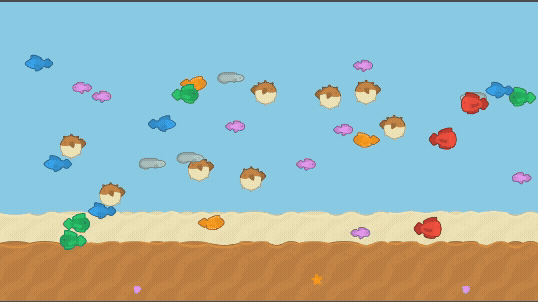

# Godot Boids Study
A Godot 4.x project implementing efficient boid behavior simulation following the approach discussed in [this Reddit post](https://www.reddit.com/r/godot/comments/1l096sw/collision_was_too_expensive_heres_what_i_did/)
about replacing expensive collision systems with boid avoidance algorithms.

## The Problem & Solution
**The Problem:**
Traditional collision detection between many entities becomes extremely expensive as the number
of objects increases. The original approach using collision bodies was barely managing 60-80
monsters at 30 FPS.

**The Solution - Boids:**
Boids (bird-oids) are autonomous agents that follow simple rules to create emergent flocking
behavior without expensive collision calculations. This project implements a simplified boid system
that:
- Uses Area2D to detect nearby units and add them to an array
- Calculates the closest unit every 0.2 seconds for performance
- Returns a repulsion vector in the opposite direction from the nearest unit
- Multiplies the vector by a configurable repulsion strength

## Project Structure
```
Assets/
├── Scripts/
│   ├── Unit.cs
│   ├── UnitMovement.cs
│   ├── UnitSpawner.cs
│   └── BoidBehavior.cs
├── Scenes/
│   └── MainScene.tscn
├── Nodes/
│   └── Unit/
│       └── Unit.tscn
└── Sprites/
    └── Fishes/
```

## Scripts Overview

- **Unit.cs** – Main unit controller; handles movement, detection, and sprite setup.  
- **BoidBehavior.cs** – Calculates repulsion vectors from nearby units.  
- **UnitMovement.cs** – Handles auto-movement, navigation, and boundary reflection.  
- **UnitSpawner.cs** – Creates units at random positions inside the spawn area.  
- **SpriteManager.cs** – Loads and provides random sprites.  

## Controls
- **Left Click:** Move unit to mouse position  
- **G Key:** Spawn enemy unit moving toward center  

## Preview


## Credits

**Boid Algorithm:**  
Based on the boid optimization technique from [this Reddit post](https://www.reddit.com/r/godot/comments/1l096sw/collision_was_too_expensive_heres_what_i_did/) by u/ShnenyDev.

**Art Assets:**  
Fish sprites from [Kenney's Fish Pack 2.0](https://www.kenney.nl) - Licensed under Creative Commons Zero (CC0).  
Support Kenney at [www.kenney.nl](https://www.kenney.nl) or [patreon.com/kenney](https://patreon.com/kenney).